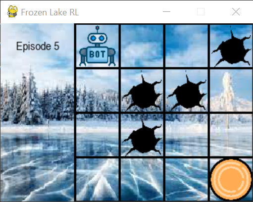
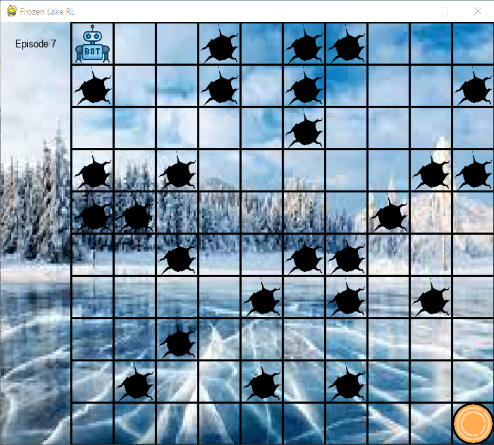

## Gym environment of frozen lake for RL for Robotics project

### Introduction
The frozen lake is a n-by-n square grid, with the robot at the top left corner,
and frisbee at the bottom right corner. There are holes randomly located on the grid. 
The objective of the robot is to learn a policy that allows it to travel from its 
starting position to the frisbee while avoiding the holes. 3 tabular methods are tested:
 Monte Carlo control without exploring starts, SARSA with e-greedy behaviour policy, and
Q-learning with e-greedy behaviour policy.

### Libraries
The necessary libraries required for running this simulation are:
- gym
- numpy
- matplotlib
- pygame

### Usage

For example, to train a Monte Carlo Agent in a frozen lake environment, you can use the command:

`python train.py --agent monte_carlo --epsilon 0.1 --gamma 0.95 --env frozen_lake --hide_video 
--train_log 100 --train_episodes 10000 --eval_freq 1000`

To train a Q-learning Agent in a large frozen lake environment for 30000 training steps
and adaptive epsilon starting from 0.03 with decay rate 0.00001, you can use the command: 

`python train.py --agent q_learning --epsilon 0.3 --epsilon_decay 0.00001 --gamma 0.95 --lr 0.01 
--env frozen_lake_large --hide_video --train_log 300 --train_episodes 30000 --eval_freq 3000`

2 environments are available: `frozen_lake` and `frozen_lake_large`, have grid size
'4x4' and '10x10' respectively.

3 agents are available: `monte_carlo`, `q_learning` and `sarsa`

The frozen lake simulation is viewable in a pygame window, but can be
 hidden using the `--hide_video` flag, to allow faster training of the RL agent.

The `frozen_lake` and `frozen_lake_large` simulation windows should appear as follows:

Information on the rest of the keyword arguments can be found in `train.py`